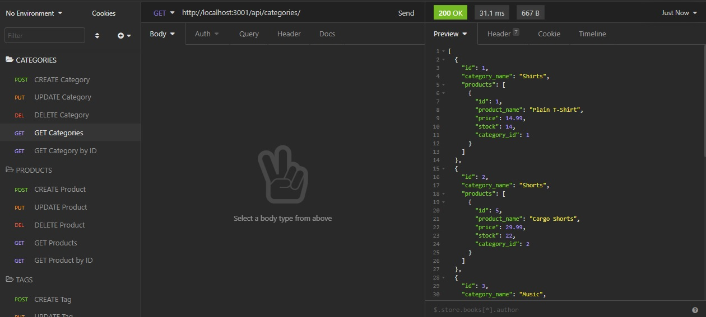
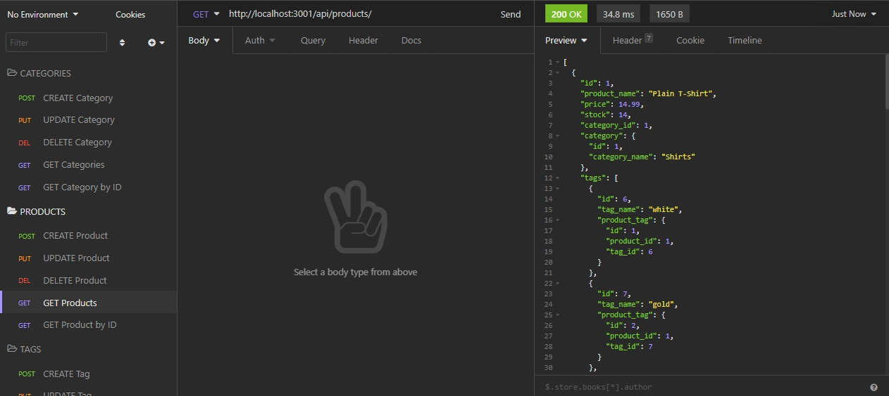

# E-Commerce Back End

[](https://opensource.org/licenses/MIT)

## Description

Building the back end for an e-commerce site using Sequelize and MySQL

The application uses the dotenv, express, mysql2, nodemon and sequelize package modules.

## 📖Table of Contents
1. [Installation](#installation)
2. [Usage](#usage)
3. [Assets](#assets)
4. [Technologies](#Technologies)
5. [License](#license)
6. [Contributing](#contributing)
7. [Tests](#tests)
8. [Questions](#questions)

## Installation
1. To install this project clone it through GitHub using the following code in the terminal: 
    ``` 
    git clone https://github.com/TrushilBudhia/E-Commerce-Back-End.git
    ```
2. To add the dependencies to the project, navigate to the root directory for the project and run:
    ```js
    npm install
    ```
    
## Usage
Once the host, port, user, password and database details have been provided to the connection and the database has been created, you can seed the database with the project data by navigating to the root directory for the application and running the following code in the terminal:
```js
npm run seed
```

With the tables generated and the seed data inserted, you can begin the application by running the following code in the terminal:
```js
npm start
```

## Assets
The link to a guide video that demonstrates the applications functionality: 

The following images shows the functionality of the application:






## Technologies
- [Node.js](https://nodejs.org/en/docs/)
- [dotenv](https://www.npmjs.com/package/dotenv)
- [Express](https://expressjs.com/)
- [mysql2](https://www.npmjs.com/package/mysql2)
- [Nodemon](https://www.npmjs.com/package/nodemon)
- [Sequelize](https://sequelize.org/v5/index.html)
- JavaScript

## License
Copyright © 2021 [Trushil](https://github.com/TrushilBudhia)

This project is [MIT](./LICENSE) licensed

## Contributing
Contributions, issues and feature requests are welcome.

Feel free to check the [issues page](https://github.com/TrushilBudhia?tab=repositories/issues) if you want to contribute.

## Tests
There are no tests currently for this application.

## Questions
For any questions, please contact the author:

- Github: [@Trushil](https://github.com/TrushilBudhia)
- Email: trushil.budhia@gmail.com

